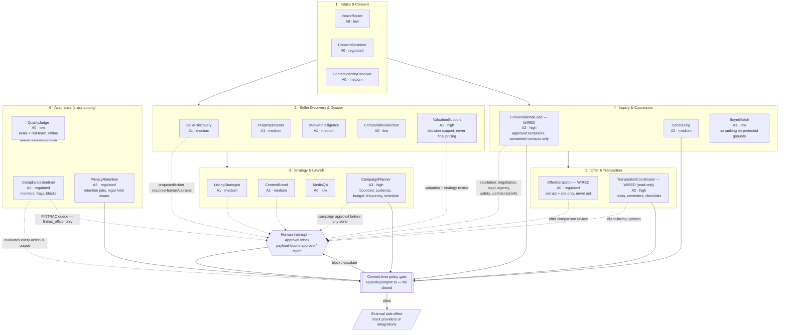

# Agent-Flow Diagram — Northstar SellerOS

All 20 spec §8 agents are implemented in `api/agents/<name>.ts` against the binding contract in `api/agents/types.ts` (`AgentResult<T>`: typed result, confidence, evidenceIds, assumptions, unresolvedConflicts, proposedAction, riskClass, autonomyLevel, requiresHumanApproval, rationale — no chain-of-thought — modelVersion, promptVersion). Agents perform **no I/O**: effects flow only through human approval and the commit-time policy gate (ADR-005).

**Runtime wiring status (honest — read before the diagram).** The diagram shows the *designed* contract flow of all 20 cores. At runtime today:

- **3 agents are wired into production call paths:** `ConversationalLead` (`api/routers/conversations.ts:11` — draft path; sends go through the commit-time gate), `OfferExtraction` (`api/routers/offers.ts:10` + `db/seed.ts`), `TransactionCoordinator` (`api/routers/transactions.ts:13` — read-only health summary, no task gating).
- **17 agents are contract-tested cores pending workflow wiring** (roadmap item): all 20 pass the `AgentResult` contract tests (`agents.test.ts`) and many are exercised by `evals/`, but they have **no production call site** — journey stages like dossier/valuation/strategy are served by seeded data and read-only routers, not by agent invocations. `SellerDiscovery`/`PropertyDossier`/`MarketIntelligence` appear in seed data and the UI only as string lineage labels.
- **`AgentResult.proposedAction` currently has no consumers outside `api/agents/`** — no runtime path turns an agent proposal into a gated action; `requiresHumanApproval ⇒ Approval Inbox` is honored by convention in the 3 wired routers, not by a central dispatcher.

Autonomy levels (spec §5): **A0** Observe · **A1** Draft · **A2** Reversible execution · **A3** Bounded campaign · **A4** Human-only commit. The `autonomyLevel` shown below is the *minimum level the agent's proposedAction requires*; whether it executes depends on tenant autonomy settings, the policy gate, and — for anything A2+ touching regulated classes — human approval.

## Human-approval interrupts (always A4 — human-only commit)

Regardless of tenant autonomy level, the following never execute without exact, payload-bound human approval (spec §5 A4):

1. Licensed acts and final factual representations (listing publication, final pricing opinion).
2. Contracts, offers — submit / accept / reject / disclose / amend / counter.
3. Funds, property access, identity-verification conclusions.
4. FINTRAC filings (STR/LCTR/LVCTR) — drafted by workflow, filed by a human officer.
5. Professional advice (legal, tax, mortgage, appraisal, inspection, engineering).
6. Competing-offer content disclosure (TRESA-08; count disclosure follows recorded written client instruction).
7. Any action where `AgentResult.requiresHumanApproval = true`, any `riskClass = regulated`, or any policy-gate verdict of `escalate`.

## Per-agent escalation triggers (ConversationalLead, spec §4)

Immediate human escalation — the conversation is flagged and the AI draft path suspends — on: uncertainty about a material property fact; negotiation; complaints; agency/representation questions; legal, tax, mortgage, appraisal, inspection, or engineering questions; discrimination or steering risk (HR-01–05); personal safety concerns; property-access requests outside approved procedures; any request touching confidential seller or offer information.

## Notes

- `ComplianceSentinel` and `QualityJudge` are assurance agents exercised by the **eval harness and contract tests**, not by runtime request paths: Sentinel's checks run at eval stage today (the commit-time gate's own linter lives in `api/policy/controls.ts`, independent of the agent); Judge is offline (`evals/` golden scenarios + seller-conversation simulator).
- `PrivacyRetention` contains retention/anonymization logic (contract-tested, eval-covered) that is **not invoked by any scheduled runtime job yet** — wiring it to the runner is a roadmap item. The approved schedule it encodes: FINTRAC 5y / RECO alignment, PIPEDA minimization, legal-hold skip.
- Tenant autonomy settings (`/settings`) cap how far A2/A3 agents may go; lowering autonomy never requires code changes — it is data consumed by the gate.
