# Data-Flow Diagram — Northstar SellerOS

Scope: the Ontario seller journey plus the side-effect path that every journey shares. Module names match `ARCHITECTURE_CONTRACT.md`. Three trust boundaries are drawn explicitly:

- **TB-1 Untrusted content:** anything a user, lead, document, website, listing remark, or tool response can write. Treated as data, never instructions (spec §10).
- **TB-2 Model gateway (`api/gateway/`):** the only path to any model. PII redaction, sensitivity routing, injection/exfiltration scan, tool allowlist, per-call token/cost caps. **Status: pre-integration scaffold** — controls are implemented and test-covered, but no production code path calls the gateway yet (agents are deterministic cores; see ARCH-4 note in `docs/ARCHITECTURE_CONTRACT.md`).
- **TB-3 FINTRAC restricted queue:** STR and suspicion artifacts visible only to role `fintrac_officer` (anti-tipping-off, FIN-07 / PCMLTFA s.8).
- **The commit-time policy gate** (`api/policy/engine.ts`) sits on the only side-effect path (ADR-005): nothing leaves the system except through `outbox → gate → provider`.

```mermaid
flowchart LR
    subgraph EXT["External actors & sources (UNTRUSTED — TB-1)"]
        L[Lead / Seller<br/>web forms, email, SMS, chat]
        BL[Buyer lead / SRP<br/>inquiries]
        DOC[Uploaded documents<br/>offers, PDFs, images]
        WEB[Public / permitted data<br/>listing remarks, websites]
        LS[Licensed listing data<br/>REALTOR.ca DDF / board MLS<br/>status: not_connected]
    end

    subgraph EDGE["api/ — Hono + tRPC 11 (tenant-scoped, zod-validated)"]
        RC[router.ts<br/>contacts · consents · properties<br/>offers · conversations · campaigns ...]
        AUTHZ[withTenant ctx guard +<br/>object-level authorization]
        UL[Upload validation<br/>type/size/malware-scan hook]
    end

    subgraph AGENTS["api/agents/ — typed agent framework (no direct I/O)"]
        IR[IntakeRouter]
        CR[ConsentResolver]
        SD[SellerDiscovery]
        PD[PropertyDossier]
        MI[MarketIntelligence]
        CS[ComparableSelection]
        VS[ValuationSupport]
        LST[ListingStrategist]
        CL[ConversationalLead]
        OE[OfferExtraction]
        SENT[ComplianceSentinel]
        PRIV[PrivacyRetention]
    end

    subgraph DB["db/ — MySQL + Drizzle (every business row carries tenantId)"]
        CRM[(contacts · consent_records<br/>suppression_list · properties)]
        DOS[(dossiers · comparables<br/>valuations · strategies<br/>evidence — kind/freshness/lineage)]
        APR[(approvals — payloadHash + destination<br/>status pending/approved/rejected)]
        WF[(workflows · workflow_events — append-only)]
        OB[(outbox — idempotencyKey UNIQUE)]
        AUD[(audit_log — append-only hash chain)]
        POL[(policy_packs · policy_rules<br/>policy_decisions)]
        FINQ[(FINTRAC artifacts · STR queue<br/>TB-3: fintrac_officer only)]
        MOD[(model_calls — provider, versions,<br/>tokens, cost, piiRedacted)]
    end

    subgraph GATEWAY["api/gateway/ — TB-2"]
        GW[Model gateway<br/>PII redact · tokenize · injection/exfil scan<br/>tool allowlist · caps · version recording]
        MOCKP[MockDeterministicProvider<br/>DEFAULT — modelVersion mock-deterministic-1]
        OAIP[OpenAICompatibleProvider<br/>Kimi K3 / Canada-hosted / self-hosted<br/>status: configured via env]
    end

    subgraph KERNEL["api/policy/ — ADR-005 commit-time gate (fail closed)"]
        ENG[engine.ts evaluateAction<br/>tenant · role · jurisdiction · consent<br/>suppression · purpose · approval freshness<br/>payload+destination hash · budget/frequency]
        ONP[packs/on.ts — Ontario pack<br/>CASL · DNCL · PIPEDA · FINTRAC · TRESA · HR]
    end

    DRAIN[Outbox drainer<br/>api/workflows/]

    subgraph PROV["api/integrations/ — providers (truthful status)"]
        MC[MockCommsProvider<br/>email/SMS — MOCK, logged]
        ML[MockListingDataProvider<br/>RESO-aligned seed, sync cursor,<br/>provenance, freshness]
        MCAL[MockCalendarProvider]
        DDF[ListingData adapter interface<br/>contract tests — not_connected]
    end

    HUM[Human — Approval Inbox<br/>payload-bound approve/reject]

    %% Lead capture → consent → CRM
    L -->|lead capture| RC
    BL -->|inquiry / SRP flag| RC
    RC --> AUTHZ
    AUTHZ --> IR
    IR --> CR
    CR -->|basis, evidence, expiry per channel| CRM
    IR -->|contact + opportunity + lead score reasons| CRM
    IR --> SD

    %% Dossier → valuation → strategy
    SD --> PD
    WEB -.->|untrusted text — TB-1| PD
    DOC --> UL
    UL --> PD
    UL --> OE
    LS -.->|when connected| DDF
    DDF -.-> ML
    ML -->|seed listings, provenance, freshness| MI
    PD --> DOS
    MI --> DOS
    CS --> DOS
    VS -->|range + CI + assumptions + disclaimer<br/>decision support, not appraisal| DOS
    VS --> LST
    LST -->|strategy draft: proposedAction only| APR
    CL -->|grounded replies, aiDisclosed, escalation| CRM

    %% Agents → gateway (TB-2) — DESIGNED path; no agent calls the gateway at
    %% runtime today (pre-integration scaffold, ARCH-4). Runtime-wired agents:
    %% CL (conversations router), OE (offers router), plus TransactionCoordinator.
    SD & PD & MI & VS & LST & CL & OE -->|model calls via gateway only — designed| GW
    GW --> MOD
    GW --> MOCKP
    GW -.->|when configured| OAIP

    %% Compliance agents
    SENT -->|policy evaluations, blocks| POL
    PRIV -->|retention jobs, legal holds| CRM
    SENT -->|suspicion indicators| FINQ

    %% Approval → workflow → outbox → gate → providers
    HUM -->|exact payload + destination approval| APR
    LST & CL & OE -->|requiresHumanApproval| APR
    APR --> WF
    WF --> OB
    OB --> DRAIN
    DRAIN -->|FRESH commit-time evaluation per send| ENG
    ENG --> ONP
    ENG -->|verdict + reasons| POL
    ENG -->|allow| MC
    ENG -->|allow| MCAL
    ENG -.->|allow, when connected| DDF
    ENG -->|block/escalate| HUM

    %% Audit everywhere
    RC & DRAIN & ENG & GW --> AUD

    %% Trust boundary styling
    classDef untrusted fill:#fde8e8,stroke:#c0392b,stroke-width:2px;
    classDef gateway fill:#fff4d6,stroke:#b8860b,stroke-width:2px;
    classDef fintrac fill:#e8def8,stroke:#6c3483,stroke-width:2px;
    classDef gate fill:#d6f5d6,stroke:#1e8449,stroke-width:2px;
    class EXT,L,BL,DOC,WEB untrusted;
    class GATEWAY,GW,MOCKP,OAIP gateway;
    class FINQ,SENT fintrac;
    class KERNEL,ENG,ONP,DRAIN gate;
```

## Reading the diagram

> **Wiring caveat (honest).** Steps 1–5 describe the *designed* agent flow. At runtime today only three agents have production call sites (ConversationalLead, OfferExtraction, TransactionCoordinator — see `docs/agent-flow-diagram.md`); dossier/valuation/strategy content in the demo is **seeded data** carrying the same evidence typing, and the gate/outbox/audit mechanics in steps 3–5 are fully real (they protect every send, including the seeded blocked-CASL decision).

1. **Lead capture → consent → CRM.** Intake is validated at the router (zod), tenant-scoped (`withTenant`), then routed by `IntakeRouter` to `ConsentResolver`, which records per-channel consent basis (express / implied / none), evidence text, capture time, and expiry in `consent_records`. A contact with no valid basis on a channel can exist in the CRM but cannot be sent anything — enforcement happens later at the gate, not at data entry.
2. **Dossier → valuation → strategy.** `PropertyDossier`, `MarketIntelligence`, `ComparableSelection`, and `ValuationSupport` write only to the evidence-typed store: every material statement carries `kind` (verified / third_party / estimate / generated / assumption), freshness, confidence, and lineage. Untrusted inputs cross TB-1 and are stored as data; when agents pass them to a model they cross TB-2 where the untrusted-content boundary (delimiters + injection scan) is enforced.
3. **Approval → outbox → gate → providers.** Agents produce `proposedAction`s, never effects. Human approval binds the exact payload hash and destination. The drainer re-evaluates the action at send time — so an approval that has gone stale, a consent that expired overnight, or a contact who unsubscribed an hour ago all still block the send. Allowed sends go to the mock providers (labeled MOCK); blocked sends return to a human with reasons.
4. **FINTRAC restricted queue (TB-3).** `ComplianceSentinel` routes ML/TF indicators, STR drafts, and PEP/HIO determinations into records readable only by `fintrac_officer`. No other role's queries, UI surfaces, or model contexts can read them — this is the anti-tipping-off control (FIN-07).
5. **Audit.** Every mutation, policy decision, model call, and drained side effect writes to the append-only, hash-chained `audit_log`; the Audit Explorer (`/audit`) reads only this chain.

## Data that never crosses TB-2

Per spec §4 and `ARCHITECTURE_CONTRACT.md`, the following are excluded from all model contexts, enforced and tested in `api/gateway/`: lockbox codes, alarm codes, personal schedules, identity documents, security instructions. Showing/access instructions are additionally access-scoped in the API and never rendered to the general model context or the seller portal.
